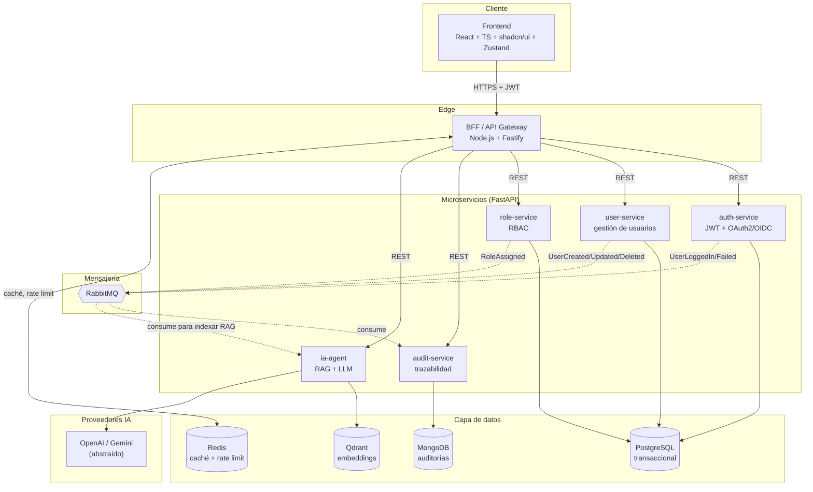

# Ejercicio 1 — Diseño y Arquitectura de Software

**Proyecto:** HotelStaffIA — sistema de gestión de usuarios con microservicios e IA
**Autor:** Edgar Guzmán Enríquez
**Fecha:** Abril 2026

---

## 1. Resumen ejecutivo

Arquitectura de microservicios dockerizada, orientada a Domain-Driven Design y Clean Architecture, con comunicación síncrona vía REST entre el frontend y un BFF, y comunicación asíncrona basada en eventos (RabbitMQ) entre microservicios. La estrategia de datos es multi-DB: PostgreSQL para datos transaccionales, MongoDB para auditoría, Redis para caché y rate limiting, y Qdrant como vector database para el agente IA (RAG).

El sistema está diseñado para ejecutarse en local con `docker compose up` y para escalar horizontalmente en producción sin cambios estructurales: cada microservicio es autónomo, sin estado compartido, y expone sus capacidades a través de contratos HTTP + eventos de dominio.

---

## 2. Diagrama de arquitectura



---

## 3. Justificación de decisiones técnicas

### 3.1 Microservicios sobre monolito

El dominio del sistema tiene **límites claramente definibles** (autenticación, gestión de usuarios, roles, auditoría, IA). Separarlos en servicios independientes permite:

- **Despliegue independiente** — el agente IA puede actualizarse o reiniciarse sin afectar el login.
- **Escalabilidad por carga real** — el `ia-agent` tiene costes y latencias muy distintas al `auth-service` y puede escalar en solitario.
- **Aislamiento de fallos** — una caída del servicio de auditoría no tumba la autenticación.
- **Diversidad tecnológica controlada** — el BFF es Node.js (por afinidad con el frontend TS), los microservicios son Python/FastAPI (por ecosistema IA); cada pieza usa la herramienta adecuada.

### 3.2 Python/FastAPI para microservicios

- **Ecosistema IA maduro**: integración directa con OpenAI SDK, LangChain, Qdrant client, embeddings.
- **Tipado estricto** vía Pydantic v2 + async nativo con excelente throughput.
- **Generación automática de OpenAPI** que consume el BFF y el frontend sin fricción.
- **SQLAlchemy 2.x** ofrece un ORM maduro con soporte async y buen encaje con Clean Architecture (repositorios desacoplados del dominio).

### 3.3 Node.js/Fastify para el BFF

- **Misma tooling TS** que el frontend (un solo lenguaje para el equipo de UI).
- **Fastify** es uno de los frameworks más rápidos en Node y tiene un ecosistema de plugins (JWT, rate-limit, CORS) que encaja con las necesidades de gateway.
- El BFF no contiene lógica de dominio: sólo **agrega, traduce y protege**. Esto evita la duplicación de reglas entre stacks.

### 3.4 Estrategia multi-DB

| Base | Uso | Razón |
|---|---|---|
| **PostgreSQL** | auth, user, role | Integridad transaccional, relaciones, constraints, migraciones versionadas con Alembic. |
| **MongoDB** | audit | Auditoría es append-only y schema-flexible (cada evento tiene su forma). Queries por rangos temporales e índices compuestos. |
| **Redis** | caché y rate limit | Latencia sub-milisegundo para sesiones/tokens activos y counters de rate limit. |
| **Qdrant** | embeddings | Vector DB especializado, búsqueda por similitud coseno, filtrado por payload, fácil dockerización. |

**Cada servicio es dueño de su base**: ningún servicio accede a la base de otro. Si `audit-service` necesita datos de usuario, los recibe en el evento o los consulta vía API — nunca joins cross-service a nivel de DB.

### 3.5 Comunicación síncrona vs asíncrona

- **Síncrona (REST)**: consultas del usuario que necesitan respuesta inmediata (login, listar usuarios, asignar rol). El BFF es el único que orquesta estas llamadas.
- **Asíncrona (RabbitMQ)**: efectos secundarios que no deben bloquear la respuesta al usuario ni acoplar servicios (auditar un login, indexar un usuario nuevo en el vector store del agente IA).

Los eventos siguen una convención **`<DominioPasado>`** (`UserCreated`, `RoleAssigned`, `UserLoggedIn`) con payload versionado.

### 3.6 Autenticación distribuida

El **auth-service** emite JWT firmados con una clave asimétrica (RS256). El **JWKS** se expone públicamente; cada microservicio valida tokens localmente sin llamar a auth en cada request. Refresh tokens viven en Redis con TTL.

Esto evita el single point of failure de una validación centralizada y mantiene la resiliencia: si `auth-service` cae, los tokens ya emitidos siguen siendo válidos hasta su expiración.

### 3.7 Integración de IA

El `ia-agent` se integra como **microservicio más**, no como módulo embebido:

- **RAG** sobre Qdrant — indexa documentos del dominio (manuales del hotel, políticas, fichas de usuarios) y los recupera por similitud para enriquecer el prompt.
- **Pipeline de embeddings** suscrito a eventos `UserCreated/Updated` para mantener el índice fresco.
- **Abstracción de proveedor LLM** — interfaz `LLMProvider` con implementaciones `OpenAIProvider`, `GeminiProvider`; el resto del servicio no depende del proveedor.
- **Observabilidad específica IA**: métricas por request de latencia, tokens in/out, coste estimado, cache hit rate de prompts.

---

## 4. Aplicación de DDD y Clean Architecture

Cada microservicio sigue la misma topología de capas (ejemplo de `user-service`):

```
services/user/
├── app/
│   ├── domain/                    # Reglas de negocio puras, sin dependencias externas
│   │   ├── entities.py            # User (entidad con invariantes)
│   │   ├── value_objects.py       # Email, HashedPassword
│   │   ├── events.py              # UserCreated, UserUpdated
│   │   └── repositories.py        # Protocolo UserRepository (interfaz)
│   ├── application/               # Casos de uso, orquestación
│   │   ├── commands/              # CreateUserCommand, UpdateUserCommand
│   │   ├── queries/               # GetUserByIdQuery, ListUsersQuery
│   │   └── services/              # UserService (coordina repo + event bus)
│   ├── infrastructure/            # Detalles: DB, mensajería, HTTP externo
│   │   ├── persistence/           # SQLAlchemy models + UserRepositoryImpl
│   │   ├── messaging/             # RabbitMQ publisher
│   │   └── http/                  # Clientes a otros microservicios
│   └── interfaces/                # Adapters de entrada
│       ├── api/                   # Routers FastAPI
│       └── events/                # Consumers RabbitMQ
├── tests/
│   ├── unit/                      # Dominio + application
│   └── integration/               # Infraestructura + API
└── Dockerfile
```

**Reglas de dependencia (Clean Architecture)**:

- `domain` no depende de nada externo — ni FastAPI, ni SQLAlchemy, ni RabbitMQ.
- `application` depende sólo de `domain` y de **interfaces** (protocolos) declaradas ahí mismo.
- `infrastructure` implementa esas interfaces usando tecnología concreta.
- `interfaces` (HTTP/eventos) inyecta dependencias y traduce al mundo exterior.

**Elementos DDD**:

- **Entidades** con invariantes verificadas en el constructor (ej. `User` no puede instanciarse con email inválido).
- **Value Objects** inmutables (`Email`, `HashedPassword`, `RoleName`).
- **Eventos de dominio** emitidos por la entidad y publicados por la capa de aplicación al guardar.
- **Repositorios** como interfaces en `domain`, implementados en `infrastructure`.
- **Bounded contexts** = cada microservicio tiene su propio modelo; `User` en `user-service` ≠ `User` en `audit-service`.

### CQRS ligero

Aplicamos CQRS **sólo donde aporta valor**: en `audit-service` las queries se optimizan con proyecciones en MongoDB distintas a las que consume el resto. En `user-service` no es necesario separar (el mismo modelo sirve lectura y escritura).

---

## 5. Flujo de datos — ejemplo end-to-end

**Caso: un administrador crea un usuario nuevo.**

1. El frontend envía `POST /users` al BFF con el JWT del admin.
2. El BFF valida el JWT localmente (JWKS cacheado), aplica rate limit (Redis) y reenvía al `user-service`.
3. `user-service` ejecuta `CreateUserCommand`:
   - Construye la entidad `User` (verifica invariantes de dominio).
   - Persiste en PostgreSQL vía repositorio.
   - Publica `UserCreated` en RabbitMQ (exchange `user.events`, routing key `user.created`).
4. El BFF devuelve `201 Created` al frontend.
5. **En paralelo y sin bloquear la respuesta**:
   - `audit-service` consume `UserCreated` y persiste un registro de auditoría en MongoDB.
   - `ia-agent` consume `UserCreated`, genera embeddings del perfil y los inserta en Qdrant para futuras consultas RAG.

---

## 6. Seguridad

- **JWT RS256** con rotación de claves y JWKS público.
- **OWASP Top 10**:
  - Inyección: queries parametrizadas vía SQLAlchemy + validación estricta Pydantic.
  - Broken Auth: tokens con `exp` corto, refresh rotativo, logout invalidante en Redis.
  - Sensitive Data: contraseñas con `argon2`, TLS obligatorio fuera del stack local.
  - XSS/CSRF: BFF sanitiza y establece headers seguros; frontend no usa cookies de sesión.
  - SSRF: cliente HTTP interno con lista blanca de destinos.
- **Rate limiting** en el BFF por IP y por `user_id` (Redis counter con sliding window).
- **Secrets** vía variables de entorno; en producción, gestor externo (AWS Secrets Manager / HashiCorp Vault).
- **Principle of Least Privilege**: cada servicio tiene su usuario de DB con permisos mínimos a su schema.

---

## 7. Escalabilidad y resiliencia

- **Stateless** en todos los servicios → escalado horizontal directo con réplicas.
- **Circuit breaker** en el BFF (plugin de Fastify) ante fallos repetidos de un microservicio.
- **Retries con backoff exponencial** en consumers RabbitMQ; DLQ (dead letter queue) para mensajes envenenados.
- **Timeouts explícitos** en todas las llamadas HTTP y LLM (el agente IA nunca cuelga el BFF).
- **Healthchecks** (`/health/live`, `/health/ready`) que Docker Compose y Kubernetes pueden consultar.
- **Graceful shutdown** — cierre ordenado de conexiones DB y consumers.
- **Idempotencia** en consumers de eventos (`event_id` único persistido) para tolerar reentregas.

---

## 8. Dockerización — explicación del `docker-compose.yml`

El `docker-compose.yml` de la raíz orquesta **toda la infraestructura más los servicios y el frontend** en un único `up`. Estructura:

- **Infraestructura base** (imágenes oficiales): `postgres:16-alpine`, `mongo:7`, `redis:7-alpine`, `rabbitmq:4-management-alpine`, `qdrant/qdrant`.
- **Microservicios y BFF** construidos desde `./services/<nombre>` y `./bff` con su propio `Dockerfile` multi-stage (build → runtime slim).
- **Frontend** construido desde `./frontend` (Vite build → nginx alpine sirviendo estáticos).
- **Dependencias entre servicios** declaradas con `depends_on: condition: service_healthy` una vez añadidos los healthchecks.
- **Redes**: una red `hotelstaff-net` interna; sólo el frontend y el BFF exponen puertos al host.
- **Volúmenes** persistentes para cada DB para sobrevivir a `docker compose down`.

El resultado: `git clone && docker compose up --build` arranca el sistema completo.

---

## 9. Observabilidad

- **Logging estructurado JSON** (`structlog` en Python, `pino` en Node) con correlation ID propagado por header `X-Request-ID`.
- **Métricas Prometheus** (`/metrics`) en cada servicio: latencias por endpoint, contadores de errores, en IA además tokens y coste acumulado.
- **Tracing** con OpenTelemetry — traces exportados a un collector OTLP (Jaeger/Tempo en despliegues reales).

---

## 10. Qué queda fuera de alcance (conscientemente)

- **Service mesh** (Istio/Linkerd) — innecesario en un entorno local; se añadiría en despliegue K8s.
- **Orquestador de producción** — se asume K8s como destino, pero el repo entrega sólo docker-compose.
- **Feature flags** — no requeridos por la prueba.
- **CI/CD completo** — se dejan las bases listas (Dockerfiles, tests, linters) para enchufar GitHub Actions fácilmente.

Estas omisiones son deliberadas para mantener el alcance manejable sin sacrificar la corrección de la arquitectura.
